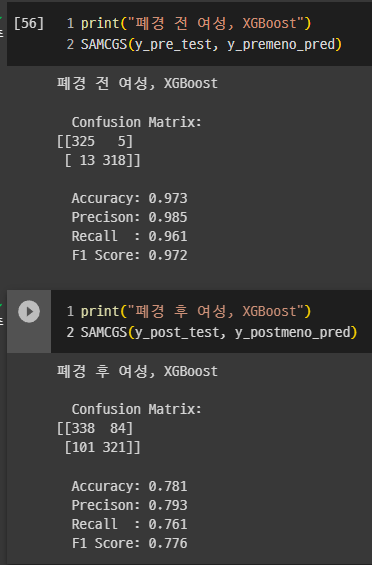

# 230529 개발 현황

## 이전 회의

- 폐경 전 / 후 여성의 골다공증 모델 분석
  
  - F1 score등 안 좋음

- 원인 분석
  
  1. unbalanced data
  
  2. 데이터 자체의 문제

- 이번 시간에 한 것.
  
  - sampling으로 모델 정확도 향상 되는지 분석
    
    - Undersampling: imblearn.under_sampling.RandomUnderSampler
    - Oversampling:imblearn.over_sampling.SMOTE
  
  - Decision Tree로 학습이 되는지 분석
  
  - Featuer importance 및 tree 분석

## 샘플링, DT 결과 분석

|         | Accuracy  | Precision | Recall    | F1 Score |
|:------- |:---------:|:---------:|:---------:|:--------:|
| Legacy  | 0.652     | 0.185     | 0.059     | 0.089    |
| Under 3 | 0.653     | 0.605     | 0.881     | 0.718    |
| Under 5 | 0.695     | 0.654     | 0.824     | 0.730    |
| Under N | 0.992     | 0.995     | 0.989     | 0.992    |
| Over 3  | 0.695     | 0.650     | **0.845** | 0.735    |
| Over 5  | **0.734** | **0.691** | 0.844     | 0.760    |
| Over N  | 0.993     | 0.995     | 0.990     | 0.993    |

- 편향성을 제거하니 전체적으로 수치 좋아짐
  
  - Oversampling이 Undersampling보다 더 높은 수치

- Under N, Over N에서 학습이 완벽하게 되었다는 것은 이 문제는 해결가능한 문제인 것을 증명함

- Feature importance 모든 경우에서 나오는 중요도가 높은 변수 유사함
  
  - AS1_AGE
  
  - AS1_PHYSTB
  
  - AS1_ALBUMIN_TR
  
  - AS1_BMI
  
  - AS1_HEIGHT

## 샘플링, XGB 결과 분석

- 샘플링 전

- max_depth: 4

- 샘플링 후

- max_depth: 7

- 의의
  
  - 샘플링은 다른 알고리즘에서도 효과가 있다.
  
  - 파라미터를 더 조정하면 성능을 향상할 여지가 있다.

## 번외: SHAP Value - Feature Importance와 비교하여

- Feature Importance
  
  - AGE의 F
